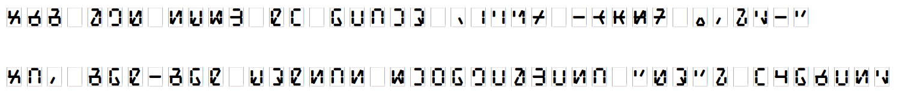

# nun1 aik2 pmcp font【十光島集倉字】

<!--  -->

pbm csxz tdnl kgh aeiuo 01234 56789 .,?!-"  
mugaxiju e belpic? mak-mak doktit nuwaxecleti "zo". hata, setija!

Available in [TTF](https://github.com/sozysozbot/nun1_aik2_pmcp_font/blob/master/fonts/gy1bet2.ttf) and [WOFF](https://github.com/sozysozbot/nun1_aik2_pmcp_font/blob/master/fonts/gy1bet2.woff).

## ビルド方法

```shell
npm install
npx tsc
node to_segment_svgs.js # セグメントディスプレイ情報を SVG に変換して glyphs/ 直下に
node to_font.js
```

## ファイル構成

本編画像は glyphs/ フォルダ。
